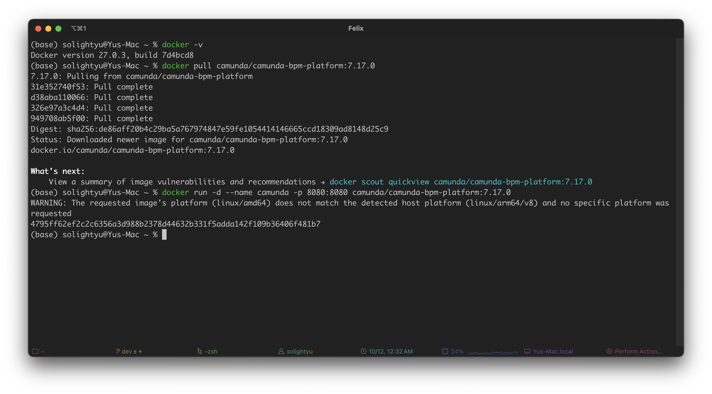

 # Camunda 学习共享文档

本文档为哈工大 服务建模与分析 （22CS32314）课程建立，用来分享学习 Camunda。
如有侵权请联系作者删除。Email： felixupri@gmail.com

******


## 1、简介

Camunda BPM 是使用 Java 开发的，其核心流程引擎（也叫 Camunda 引擎，简称引擎）运行在 JVM 里面，是一个纯 Java 库。

### 学习文档

官方文档：https://forum.camunda.io/

GitHub 社区：https://github.com/camunda-community-hub

欢迎同学继续补充.....

### 资源推荐

《Camunda 工作流开发实战 ——Spring Boot+BPMN+DMN》李贵俊 编著

PDF：https://www.tup.com.cn/upload/books/yz/087906-01.pdf  （仅有书籍上半部分）

哈工大图书馆资源：图书馆有纸质与电子资源，同学们可去翻阅。


欢迎同学继续补充.....

****

## 2、流程引擎下载与部署

Camunda 提供多种部署方式，本文档演示使用独立平台的方式部署，这种用法适合分布式，微服务，多语言异构系统的使用方式。


### 2.1-Docker 部署

此方式安装部署极为方便，拉取即可在本地部署使用，建议熟悉 docker 的同学使用。
Docker 学习资源：https://www.runoob.com/docker/docker-tutorial.html

Docker 部署参考文档：https://github.com/camunda/docker-camunda-bpm-platform/tree/7.17

拉取镜像：

本次演示使用 Camunda7版本：7.17.0

````
docker pull camunda/camunda-bpm-platform:7.17.0
````

或可拉取最新版本

````
docker pull camunda/camunda-bpm-platform:latest
````


运行容器：

````
docker run -d --name camunda -p 8080:8080 camunda/camunda-bpm-platform:7.17.0
````




​	因演示是在arm架构机器运行，由于架构不匹配，Docker运行这个镜像，这可能会影响性能。使用arm架构的同学可以尝试查找是否有适合arm架构的 Camunda 镜像，测试在x86架构下运行无影响。


镜像运行成功后，访问地址即可使用。

Username：demo
Password：demo

访问地址 1：http://localhost:8080/camunda/app/welcome/default


访问地址 2：http://localhost:8080/camunda-welcome/index.html


#### 修改数据库 (选做)

默认数据库是H2 。

H2 是一个嵌入式数据库，这意味着数据会存储在本地文件中。适合测试和开发，但在生产环境中一般使用其他数据库如 MySQL。

待补充.....


****

### 2.2-SpringBoot 部署

官方文档：https://docs.camunda.org/manual/7.17/user-guide/spring-boot-integration/

使用 Spring Boot 部署需要一些 Java 、 Maven 与Spring Boot 的前置知识。
安装条件：

>1. 安装 jdk1.8 以上。
>2. 安装 Maven 3.6 以上。
>
>相关资源：
>
>Java 快速入门：https://liaoxuefeng.com/books/java/quick-start/index.html 
>
>Maven 基础: https://liaoxuefeng.com/books/java/maven/index.html  (Maven学习时长大概 20 分钟)
>
>Spring Boot 开发：https://liaoxuefeng.com/books/java/springboot/index.html
>
>（Java 、 Maven 与 Spring Boot的学习资源众多，大家可自行选择食用）
>
>


Camunda 官网提供了构建模板。官网地址：https://camunda.com/download/
（Camunda7 与 Camunda 现并行开发与维护。Camunda 7更适合传统企业应用和需要嵌入式工作流的场景，依赖于 Java 技术栈和关系型数据库。Camunda 8引入了 Zeebe，引入了更现代化的架构，更加适合云原生环境、大规模的分布式工作流处理。）

因本文档演示使用 Camunda7，在官网选择此路径构建（Resources-> Develop-> Camunda 7 - Downloads -> Camunda 7 Community Download-> Generate a Spring Boot Project）下载构建。
**或直接使用此地址进行下载构建**：https://start.camunda.com/ 


#### Camunda Automation Platform 7 Initializr

>演示选择Java Version 17 、Camunda Version 7.22.0
>（数据库可在本地配置 MySQL）
>
>需要自行设置用户名与密码，也可稍后在本地配置。
>此处演示为
>Username：demo
>Password：demo
>
>可按下图进行选择配置，也可自行按需选择。
>点击 Generate Project 即可下载。


#### 运行

下载后即可解压，选择使用 IDE 打开，本次演示选择 IntelliJ


若不需要修改数据库，即可直接运行。


运行成功后，访问地址http://localhost:8080/ 即可登录使用。


登录成功后，可看到默认的演示流程，即文件中的 process.bpmn


####  修改数据库（选做）

默认数据库是H2 。

H2 是一个嵌入式数据库，这意味着数据会存储在本地文件中。适合测试和开发，但在生产环境中一般使用其他数据库如 MySQL。

待补充.....


## 3、流程设计器

Camunda Modeler 下载地址：https://camunda.com/download/modeler/

Camunda 提供有 Web Modeler 并提供 30 天全功能试用


也提供了开源的桌面版本，同学们可选择适合的版本下载安装。


安装成功后即可使用


